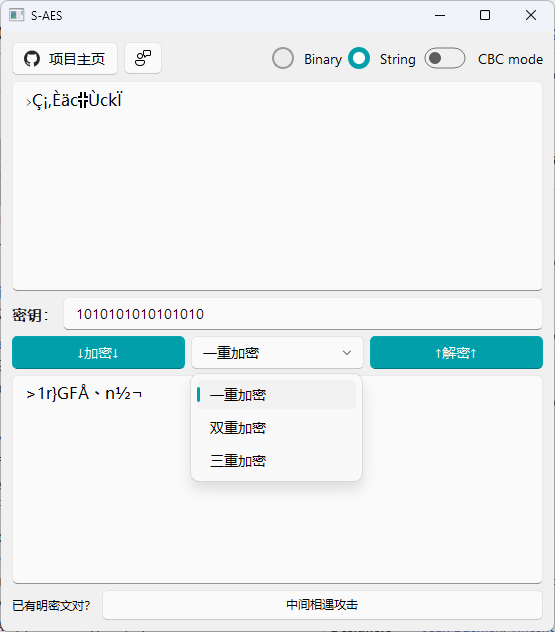

# 开发手册


## 1. 简介

​	本次开发是基于S-DES算法借助于Python和PyQt5语言的实现简易加解密功能与暴力破解的功能的小型程序。

​	使用的开发环境为Windows11 + VSCode/PyCharm，借助于git实现版本库管理，用以编程实现算法和用户界面设计。


## 2. 总体设计和使用介绍

​	S-AES是AES加密算法的简化版本，本程序使用Python和PyQt5实现了使用16bit密钥对任意个数（长度）的16bit明/密文的加密和解密功能，以及对ASCII编码字符串进行加解密的功能。此外，本程序不仅实现了S-AES的一重加密，还将S-AES算法通过双重和三重加密进行拓展，支持密钥长度为32bits（双重）或48bits（三重）。如已知一对或多对明密文对，本程序能够执行中间相遇攻击，查找可能的密钥组合。本程序的GUI界面美观、友好，设计有异常输入处理，问题弹窗等功能。

使用方法详见[用户指南](用户指南.md)




## 3. 文件结构

### S_AES.py

- Class S_AES:
  - def to_nibble_matrix: 将输入的16bits字符串转化为半字节矩阵
  - def Add_Ket: 密钥加函数将16位状态矩阵与16位轮密钥逐位异或，逆函数是其本身
  - def Nibble_Substitution: 半字节代替函数式简单的查表操作
  - def Shift_Row: 行位移函数在状态的第二行执行一个半字节循环移位，第一行不变，逆函数也是其本身
  - def Mix_Column: 列混淆函数在各列上执行，列中的每个半字节都映射为一个新值，其中新值是该列中两个半字节的函数，由在状态的GF(2^4)上的矩阵乘法定义
  - def key_extension: 对于密钥拓展而言，16位初始密钥被分成两个8位字
  - def to_str: 将半字节矩阵转换回16bits字符串
  - def encrypt: 加密主程序，是上述函数的一个复合函数
  - def decrypt: 解密主程序，是上述函数的一个复合函数

### GF_2_4.py

- 此文件为封装好的伽罗华域2^4的加法和乘法程序，于列混淆函数中计算使用

### main.py

- 此文件为程序前端主界面，包含程序的入口及各控件的实现和设置

### cracker.py

- 此文件为暴力破解子界面的前端代码，包含界面各控件的实现和设置

### utils.py

- 此文件为一些实用的函数
  - to_16bits函数将任意长的字符串切割成长度为16bits的子字符串返回给后端
  - is_bin函数使用正则表达式匹配字符串是否只包含 "0" 和 "1"
  - str2asc函数使用列表推导将字符串中的字符转换为它们的ASCII码值的二进制表示，并将结果连接成字符串
  - asc2str函数从连续的8位二进制值中提取每个二进制表示，然后将其转换为字符
  - showErrorInfoBar函数提供快捷创建从右下角弹出的警告框的方法
  - openWebsite函数提供使用按钮打开网页的方法

### ui_main.py & ui_cracker.py

- 是使用pyuic5将QT Design工具创建的.ui文件转换为的.py文件

### two_fold_S_AES.py

- 此文件为多重加密后端代码，提供双重加密和三重加密接口

### brute_force.py

- 此文件为中间相遇攻击后端代码，运用了二分查找大幅度提高了破解效率，时间复杂度为O(2^17*log(2^16))

### CBC.py

- 此文件为使用密码分组链(CBC)模式对较长的明文消息进行加密后端代码

## 4. 引用外部库

```python
click==8.1.7
colorama==0.4.6
darkdetect==0.8.0
PyQt-Fluent-Widgets==1.3.5
PyQt5==5.15.9
PyQt5-Frameless-Window==0.3.6
pyqt5-plugins==5.15.9.2.3
PyQt5-Qt5==5.15.2
PyQt5-sip==12.13.0
pyqt5-tools==5.15.9.3.3
python-dotenv==1.0.0
pywin32==306
qt5-applications==5.15.2.2.3
qt5-tools==5.15.2.1.3
```