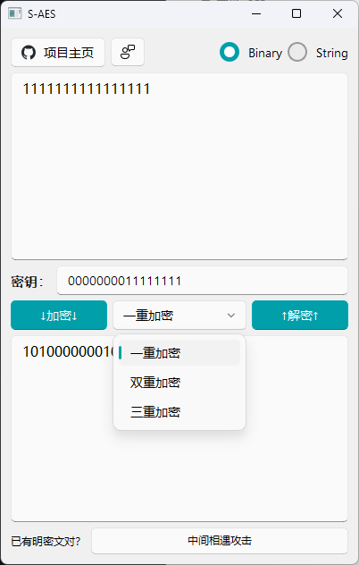
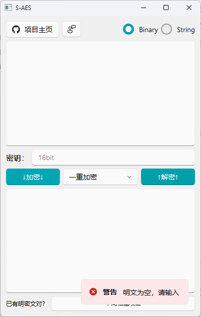

# 用户指南

## 程序简介

​	S-AES是AES加密算法的简化版本，本程序使用Python和PyQt5实现了使用16bit密钥对任意个数（长度）的16bit明/密文的加密和解密功能，以及对ASCII编码字符串进行加解密的功能。此外，本程序不仅实现了S-AES的一重加密，还将S-AES算法通过双重和三重加密进行拓展，支持密钥长度为32bits（双重）或48bits（三重）。如已知一对或多对明密文对，本程序能够执行中间相遇攻击，查找可能的密钥组合。本程序的GUI界面美观、友好，设计有异常输入处理，问题弹窗等功能。

## 使用说明

### 加解密主界面

- 左上角的按钮可以跳转到本程序的Github仓库和提出反馈（跳转至issue界面）
- 右上角的RadioButton可以切换二进制模式和字符串模式
- 在上方的输入框输入明文后可点击加密按钮进行加密
- 中间的输入框输入16/32/38bits的密钥
- 中间的下拉框可以选择加密的方式
- 在下方的输入框输入密文后可点击解密按钮进行解密
- 右下角的中间相遇攻击按钮可进入暴力破解子界面

### 暴力破解界面

- 最上方的滚动框可以输入或改变要输入的明密文的对数
- 上方的表格可以键入已有的明密文对
- 中间的按钮可依据已知的明密文对进行暴力破解
- 下方的表格将给出破解结果可能的密钥

## 额外功能说明

### 异常输入处理

- 本程序设计了对用户的异常操作进行拒绝和警告弹窗的处理，防止程序因错误输入而崩溃，包括：
  - 明/密文为空或不完整
  - 明/密文/密钥不是bit串
  - 明/密文不是整数个Byte
  - 密钥长度不是16/32/48位

### UI设计

本借助[PyQt-Fluent-Widgets](https://github.com/zhiyiYo/PyQt-Fluent-Widgets/tree/master)进行GUI的设计和编写，完成了一个比较美观和实用的小程序，实现了包括但不限于以下组件：

- 动态确定明密文对数的表格形式的输入
- 计时器小提示消息框